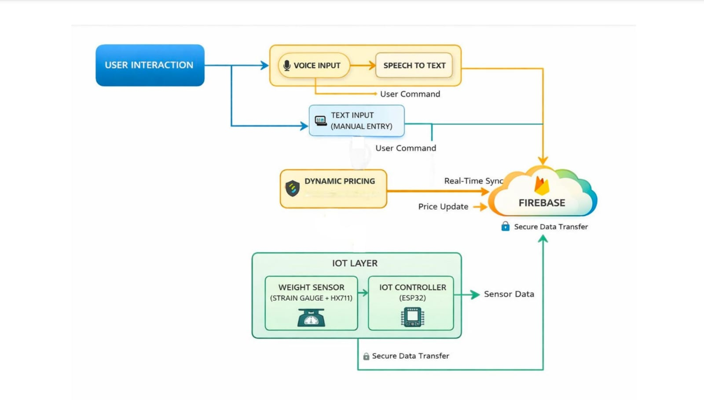
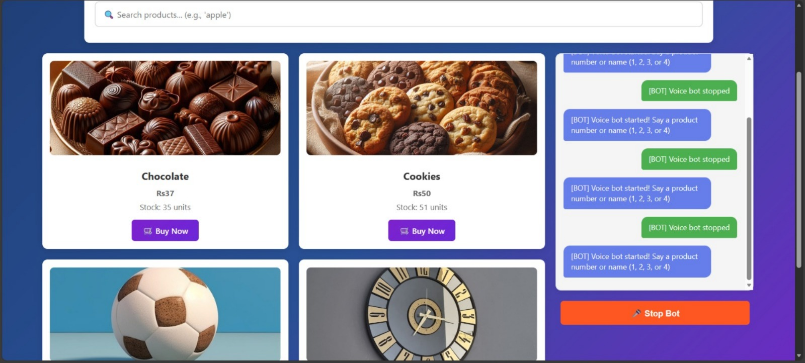
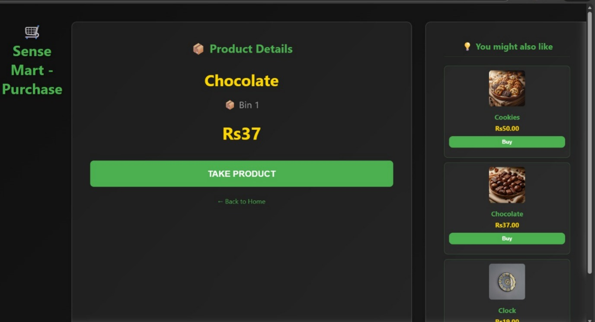
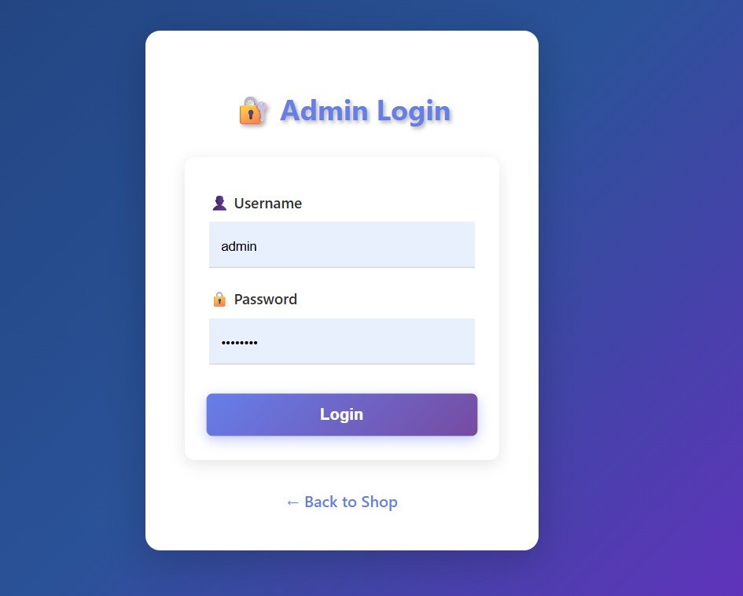
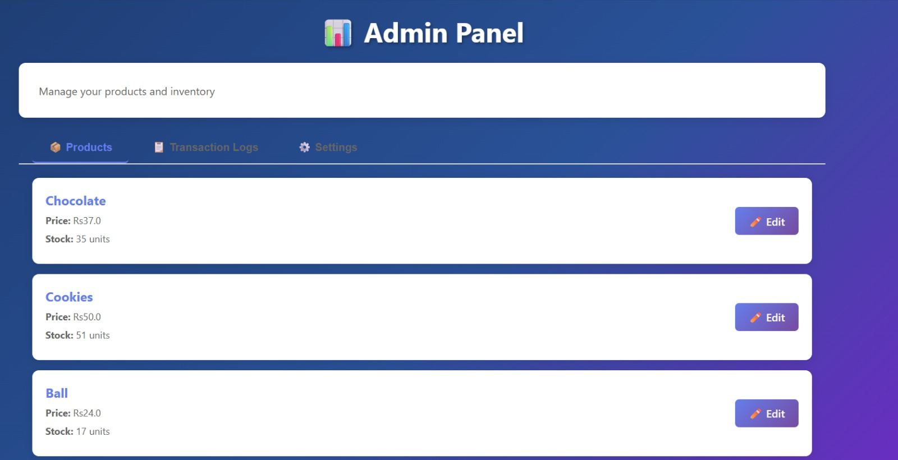
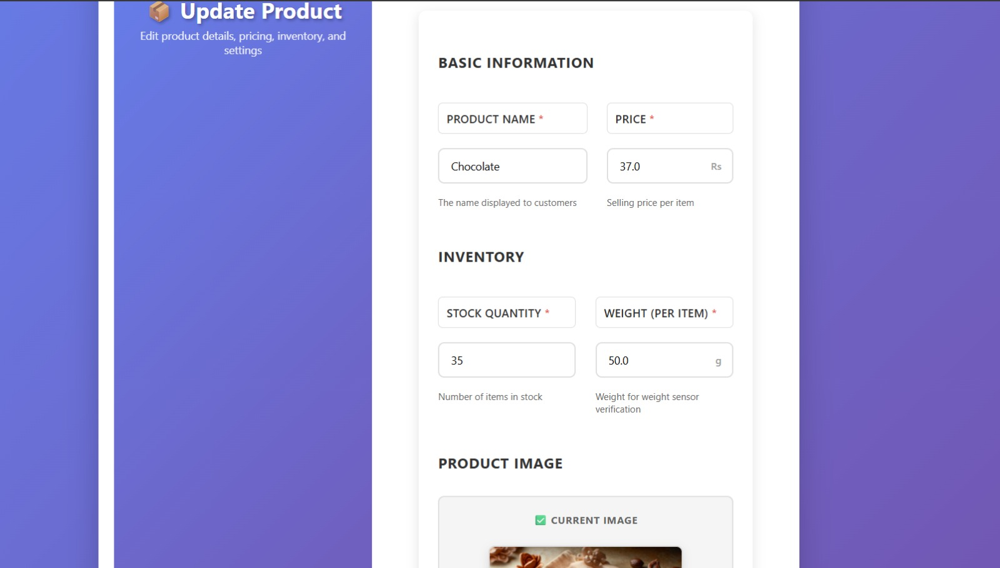

# SenseMart V1

## Smart IoT Vending Machine using Python, Flask, Firebase and ESP32

SenseMart V1 is an IoT-based smart vending machine that combines a Flask web application with Firebase cloud services and an ESP32 microcontroller to automate product purchasing, inventory management, and real-time monitoring.

The system allows customers to browse and purchase products through an intuitive web interface while enabling administrators to manage inventory, pricing, and transactions from a centralized dashboard.

---

## Overview

The project integrates software and hardware components to create an automated vending machine capable of:

- Product browsing and purchasing
- Voice-assisted product search
- Real-time inventory monitoring
- Weight sensor verification
- Cloud synchronization using Firebase
- Administrative inventory management

---

## Features

### Customer Features

- Browse available products
- Search products
- Voice-assisted product selection
- QR code payment support
- Product recommendations
- Live stock availability

### Administrator Features

- Secure administrator login
- Product management
- Inventory management
- Dynamic pricing
- Transaction history
- Product image management
- Analytics dashboard

### IoT Features

- ESP32 integration
- Weight sensor monitoring
- Firebase cloud synchronization
- Serial communication
- Automatic inventory updates

---

## System Architecture

<p align="center">
    
</p>

The system consists of:

- Customer Interface
- Flask Backend
- Firebase Database
- ESP32 Controller
- Weight Sensor
- Voice Recognition Module
- Administrator Dashboard

---

## Application Screenshots

### Customer Home

Customers can browse products, search products manually, and use voice commands for product selection.

<p align="center">
    
</p>

---

### Product Purchase

Displays product details, pricing, recommendations, and purchase confirmation.

<p align="center">
    
</p>

---

### Administrator Login

Secure authentication for administrators.

<p align="center">
    
</p>

---

### Administrator Dashboard

Manage inventory, pricing, transactions, and system settings.

<p align="center">
    
</p>

---

### Product Management

Update product information including:

- Product name
- Price
- Stock quantity
- Product weight
- Product image

<p align="center">
    
</p>

---

## Technology Stack

| Category | Technologies |
|-----------|--------------|
| Backend | Python, Flask |
| Frontend | HTML, CSS, JavaScript |
| Database | Firebase Firestore, SQLite |
| Hardware | ESP32, HX711 Load Cell |
| Communication | Serial Communication |
| Version Control | Git, GitHub |

---

## System Workflow

```text
Customer
    │
    ▼
Flask Web Application
    │
    ├──────────── Customer Interface
    ├──────────── Firebase
    ├──────────── Administrator Dashboard
    │
    ▼
ESP32 Controller
    │
    ▼
Weight Sensor
    │
    ▼
Inventory Verification
    │
    ▼
Real-Time Database Update
```

---

## Project Structure

```text
SenseMart-V1/
│
├── app.py
├── firebase_config.py
├── firebase_db.py
├── requirements.txt
├── setup.py
│
├── static/
├── templates/
├── esp32_example/
│
├── docs/
│   └── screenshots/
│       ├── architecture.jpeg
│       ├── home.jpeg
│       ├── product.jpeg
│       ├── admin_login.jpeg
│       ├── admin_panel.jpeg
│       └── update_product.jpeg
│
└── README.md
```

---

## Installation

Clone the repository.

```bash
git clone https://github.com/abhinav7860/New_Vending_Machine.git
```

Navigate to the project directory.

```bash
cd New_Vending_Machine
```

Create a virtual environment.

```bash
python -m venv venv
```

Activate the environment.

### Windows

```bash
venv\Scripts\activate
```

### Linux / macOS

```bash
source venv/bin/activate
```

Install dependencies.

```bash
pip install -r requirements.txt
```

Run the application.

```bash
python app.py
```

Open the application in your browser.

```
http://127.0.0.1:5000
```

---

## Hardware Requirements

- ESP32 Development Board
- HX711 Load Cell Amplifier
- Load Cell
- USB Serial Communication

Upload the Arduino sketch located in:

```
esp32_example/esp32_weight_example.ino
```

before running the application.

---

## Default Administrator Credentials

Username

```
admin
```

Password

```
admin123
```

> Change the default credentials before deploying the application.

---

## Future Enhancements

- AI-based product recommendation
- Mobile application
- UPI payment integration
- Face recognition authentication
- Remote machine monitoring
- Predictive inventory management
- Advanced sales analytics

---

## Author

**Abhinav Sabu**

Bachelor of Technology in Computer Science and Engineering

GitHub: https://github.com/abhinav7860

LinkedIn: *(Add your LinkedIn profile URL)*

---

## License

This project is intended for academic and educational purposes.

---

## Acknowledgements

This project was developed as part of a smart IoT vending machine solution demonstrating the integration of web technologies, cloud services, and embedded systems.
